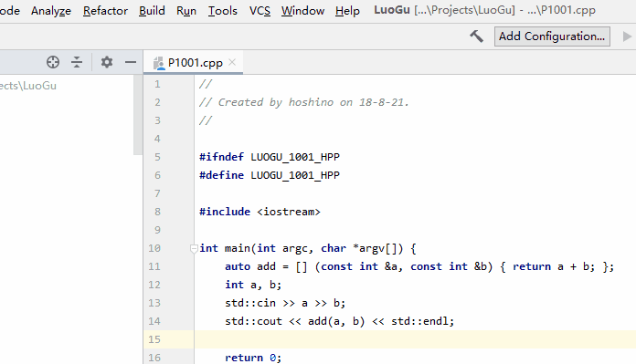

# luogu-intellij

[](https://plugins.jetbrains.com/plugin/12846-luogu-intellij)
[](LICENSE.md)

CI      | Status
--------|-------
CircleCI|[](https://circleci.com/gh/HoshinoTented/luogu-intellij)

A luogu plugin on intellij platform  

## Features
- [x] Log in / Log out
- [x] Problem: Submit code
- [x] Listen record information 
- [ ] Better record UI
- [x] Paste Board
- [x] Two Factor Verification

## Screen shots


## Shortcuts
Shortcut             | Action
:-------------------:|:--------:
Ctrl + Shift + S     | Submit Code (current file) 

## Building and Installation
First, you should configure JDK in proper  
Then, run this code in terminal:  

```bash
./gradlew build
```

If you want to get a intellij plugin, please run this code:  

```bash
./gradlew shadowJar
```

There is a fatjar will be generated in directory `build/libs`  