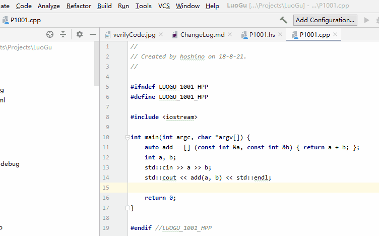

# luogu-intellij

[简体中文](README-CN.md)

CI      | Status
--------|-------
CircleCI|

A luogu plugin on intellij platform  

# Function
- [x] Base: log in
- [x] Problem: Submit code
- [x] Listen record information
- [ ] Better record UI

# Screen shot
